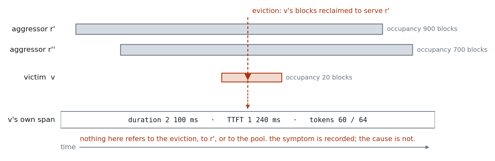
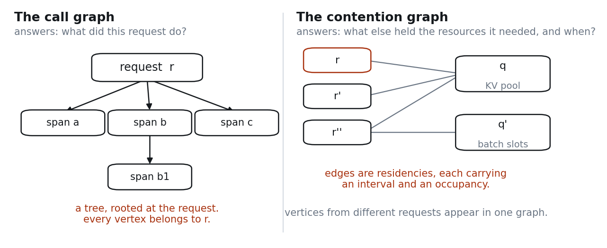

# Contention Graph: demonstrating an attribution gap in LLM inference telemetry

[](https://doi.org/10.5281/zenodo.22205181)

A reproducible experiment showing that when one request degrades another through shared
KV-cache pressure, **per-request tracing records the symptom and does not record the cause** —
and a minimal instrumentation that closes the gap.

Runs on a single GPU against an open-source serving runtime and an open-weight model.
No proprietary data, no vendor telemetry, no client environment.

**Result:** H2 and H3 not falsified against vLLM 0.28.0. See [Status](#status).
The citable state is `v0.2.1-citable`; `v0.2-first-result` carries the same data and
the same verdicts, but its reproduction instructions do not run.

---



## The claim being tested

Production inference observability is organised around the **request path**. A request enters,
traverses a set of components, and produces a response; instrumentation records what happened
along that path.

A significant class of cause lies *off* that path. When a long-context request evicts a
latency-sensitive request's cache blocks, the victim's time-to-first-token rises. The victim's
span records the elevated latency. It does not record the eviction, because the eviction is not
an event on the victim's path — it happened to the victim, not in it.

The information needed to attribute the degradation **exists somewhere in the system**: the
scheduler knows what it preempted and when. But it is not joined to the victim request. There
is no shared key. Attribution requires a correlation that nothing in the current telemetry
model is built to express.

This repository tests that claim and then tests whether adding one thing — a record of *which
request occupied which bounded resource over which interval* — makes attribution possible.



The full argument, the instrumentation, and the proposed semantic conventions are in
[`docs/WHITEPAPER.md`](docs/WHITEPAPER.md).

### Hypotheses

| | Statement | Falsifiable by |
|---|---|---|
| **H1** | Under cache pressure from a co-resident workload, victim TTFT degrades measurably | No degradation observed at any aggressor intensity |
| **H2** | The victim's OTLP span contains no attribute identifying the aggressor, the eviction, or the cache pressure | Finding such an attribute in the emitted spans |
| **H3** | Runtime-level metrics record that preemption occurred but cannot be joined to the affected request | Finding an existing join key between preemption events and victim requests |
| **H4** | Adding residency records `(request_id, resource, t_start, t_end)` makes the victim→aggressor attribution derivable | Attribution remains ambiguous with residency data present. **Requires an instrumented runtime; reports NOT RUN otherwise** |

**H2 and H3 are the point.** H1 only establishes that there is something to attribute.
If H2 or H3 is falsified, the premise of this work is wrong and that is worth knowing.

**H4 cannot be tested without instrumenting the runtime.** The collector can reconstruct an
approximate contention graph from client-side timings, which is useful for exercising the join
but assumes the quantity H4 asks about. On such input the analysis reports `NOT RUN — INPUT
CANNOT TEST H4` rather than a verdict.

---

## What this is not

- **Not a benchmark.** No claim about the runtime's performance. The aggressor workload is
  constructed to induce pressure, not to represent realistic traffic.
- **Not a product.** The collector in `src/contention_graph.py` is the minimum needed to test
  H4, not an implementation intended for production.
- **Not a claim of novelty in scheduling.** That cache pressure causes interference is well
  known to anyone who operates these systems. The claim concerns what the *telemetry* records
  about it.
- **Not validated at scale.** Single GPU, single node. The generalisation to multi-node,
  multi-tenant production is exactly what is untested here.

---

## Running it

Requirements: one GPU with sufficient memory for the chosen model; Python 3.10+; a serving
runtime with OTLP tracing enabled and a Prometheus metrics endpoint.

```bash
pip install -r requirements.txt

# 0. Validate the harness with synthetic inputs and a local fake runtime — no GPU required.
./selftest.sh

# 1. Start the OTLP sink, then the runtime pointed at it. See docs/RUNTIME_SETUP.md;
#    flags differ between runtimes and versions. Check prompt sizing in the scenario
#    against --max-model-len before starting, and confirm one hand-issued request
#    produces a span, because H2 cannot be evaluated without one.
python3 tools/otlp_file_sink.py --out runs/otel-spans.jsonl --port 4318 &

export INFERENCE_MODEL=Qwen/Qwen2.5-1.5B-Instruct     # or whatever you are serving

# 2. Two baselines and three intensities. Two baselines because a contention result
#    measured against a machine that was not measured twice cannot be distinguished from
#    one measured against a machine that drifted; three intensities because a single point
#    cannot separate "pressure causes this" from "this point produces a number worth
#    reporting". Both are required by docs/provenance/PUBLICATION_CHECKLIST.md.
#
#    Metrics are scraped DURING each run, never after. wait on the collector's own PID:
#    a bare `wait` also waits for the sink and the runtime, which never exit.
run_one () {
  python -m src.collect --out "runs/$1" \
      --metrics-url http://localhost:8000/metrics \
      --scrape-seconds "$3" --scrape-interval 0.1 &
  local collector=$!
  python -m src.workload --scenario "scenarios/$2" --out "runs/$1"
  wait $collector
  sleep 20                                            # let the engine drain
}

run_one baseline_a       baseline.yaml         150
run_one baseline_b       baseline.yaml         150
run_one contention_low   contention_low.yaml   320
run_one contention_mid   contention_mid.yaml   320
run_one contention_high  contention_high.yaml  320

# 3. Spans and the contention graph, once the runs are over. Span ids are joined to client
#    ids through the response ids recorded in requests.json, so this must come after the
#    workload has written that file.
for lvl in low mid high; do
  python -m src.collect --out "runs/contention_$lvl" \
      --spans-from runs/otel-spans.jsonl \
      --reconstruct        # or --residency-from, if the runtime has been patched
done

# 4. The sweep first: if the two baselines disagree, nothing below it means anything and
#    the correct action is to stop, not to keep the quieter baseline.
python -m src.sweep --baselines runs/baseline_a runs/baseline_b \
                    --points runs/contention_low runs/contention_mid runs/contention_high

# 5. Verdicts. The mid point is reported; the sweep is what shows it was not chosen.
python -m src.analyze runs/baseline_a runs/contention_mid
```

**The metrics scrape has to overlap the workload.** It polls a live endpoint, so a scrape
started after the workload has finished samples an idle server: every series is flat, and
the result is indistinguishable from a runtime that reported nothing under load. `src.collect`
warns when every series it captured was constant, but the run still has to be repeated.

Set `--scrape-seconds` longer than the workload takes; the scrape stopping early is the same
failure in a smaller form.

`analyze` prints a verdict on each hypothesis and writes `runs/report.md`.

---

## What a result looks like

The output that matters is not the latency numbers. It is the attribute inventory. This is
`runs/report.md` from the published run, not an illustration:

```
H2  the victim's span does not name the cause
    -> NOT FALSIFIED
    victim spans captured: 2965
    attributes present: gen_ai.latency.e2e, gen_ai.latency.time_in_model_decode,
      gen_ai.latency.time_in_model_inference, gen_ai.latency.time_in_model_prefill,
      gen_ai.latency.time_in_queue, gen_ai.latency.time_to_first_token,
      gen_ai.request.id, gen_ai.request.max_tokens, gen_ai.request.n,
      gen_ai.request.top_p, gen_ai.usage.completion_tokens,
      gen_ai.usage.prompt_tokens, request.id, request.id.server
    attributes referencing a co-resident request, an eviction, or cache pressure: (none)
```

Fourteen attributes. The runtime splits latency into queue, prefill and decode; it records
that a request waited and for how long. It does not record what it waited behind. The absence
is specific, not a gap someone forgot to fill — and it is the finding. Everything else in the
repository exists to make that absence demonstrable rather than asserted.

### Checking the published data

Every artefact carries a SHA-256 in [`runs/CHECKSUMS.txt`](runs/CHECKSUMS.txt), including the
series files stored gzipped:

```bash
# Paths in CHECKSUMS.txt are relative to the repository root; run it from there.
gunzip -k runs/*/metrics.json.gz runs/*/spans.json.gz runs/*.jsonl.gz
shasum -a 256 -c runs/CHECKSUMS.txt        # 23 files, expect no FAILED
```

The verdicts can be recomputed from the committed data, without a GPU and without the
runtime. This is the check that matters: it is the difference between a repository that
reports a result and one from which the result follows.

```bash
python -m src.sweep --baselines runs/baseline_a runs/baseline_b \
                    --points runs/contention_low runs/contention_mid runs/contention_high
python -m src.analyze runs/baseline_a runs/contention_mid --report /tmp/recomputed.md
diff runs/report.md /tmp/recomputed.md      # expect no output
```

`report.md` regenerates byte-for-byte and the sweep returns the same 1.17x, 3.06x and 10.34x.
Nothing in the published verdicts depends on anything not in this repository.

---

## Layout

```
src/workload.py           victim / aggressor generators against an OpenAI-compatible endpoint
src/collect.py            span parsing, metrics scraping, graph build, --mock mode
src/align.py              joins request timings to engine state on the shared monotonic clock
tools/otlp_file_sink.py   OTLP/HTTP receiver writing spans as JSON lines, in place of a Collector
src/contention_graph.py   the proposed residency record and the attribution join
src/analyze.py            hypothesis evaluation, report generation
src/sweep.py              baseline stability and the intensity curve
selftest.sh               zero-GPU validation of the whole pipeline
tests/mock_vllm.py        fake runtime used by the loopback stage of the self-test
scenarios/*.yaml          workload definitions; contention_{low,mid,high} are the sweep
docs/WHITEPAPER.md        the argument, the definition, the proposed conventions
docs/figures/             figures, as PNG and vector PDF
docs/METHOD.md            experiment design, threats to validity
docs/RUNTIME_SETUP.md     runtime flags, metric names, version notes
docs/provenance/          versioning policy, publication checklist, and the two scripts
                          that emit citation identifiers and assemble the exhibit
runs/                     the published run data, verdicts, sweep, provenance, checksums
```

---

## Status

**First result, 2026-08-31.** Five runs against vLLM 0.28.0 on a single GPU. Verdicts are in
[`runs/report.md`](runs/report.md), the intensity sweep in [`runs/sweep.md`](runs/sweep.md),
and the environment in [`runs/provenance.txt`](runs/provenance.txt).

| | Verdict | |
|---|---|---|
| **H1** | NOT FALSIFIED | victim p95 TTFT rises 1.17x, 3.06x, 10.34x across three aggressor intensities |
| **H2** | NOT FALSIFIED | 2,965 victim spans carry 14 attributes; none names a co-resident request, an eviction, or cache pressure |
| **H3** | NOT FALSIFIED | the runtime exposes cache-occupancy and preemption series with no per-request label |
| **H4** | NOT RUN | requires residency records from an instrumented runtime; the reconstructed graph cannot test it |

Two consecutive baselines agreed to within 1.03x, so the environment held still across the
comparison. Every aggressor request was served at every intensity, so no point applied less
pressure than its label claims.

**What H2 rests on.** The victim spans carry `gen_ai.latency.time_in_queue`,
`gen_ai.latency.time_in_model_prefill`, `gen_ai.latency.time_in_model_decode` and nine other
attributes. This is not a runtime that instruments sparsely. It records that a request
waited and for how long; it does not record what it waited behind. The absence is specific,
not a gap someone forgot to fill.

**One observation not anticipated in the design.** At low aggressor intensity, queue depth at
admission separates fast victim requests from slow ones. At high intensity it stops doing so:
389 of 400 requests fall in one bin spanning p50 27ms to p95 348ms, because a request
admitted against a full pool but before a queue has formed has queue depth zero. Cache
occupancy separates the same requests cleanly at both intensities. A signal on the request
path proxies for the off-path cause under light load and fails under heavy load — which is
when attribution is wanted. `src/align.py` reports this rather than presenting the
queue-depth gradient as a finding.

**What is not established.** H1's ratios are population-level. Most victim requests were
admitted against a nearly empty pool even at the highest intensity, so the p95 rise is
carried by a minority; the alignment tables show which. Single GPU, single node, one runtime,
one model, synthetic load. Nothing here establishes how often eviction occurs in production,
or that the gap persists across multi-node topologies or real traffic mixes.

## Licence

Apache-2.0. The instrumentation in `src/contention_graph.py` is intended for contribution
upstream rather than retention.

## How results here are published

Versioning, the checklist run before any result is published, and the rules on provenance and
on not revising results after publication are in [`docs/provenance/`](docs/provenance/).
That directory also records where this work is cited externally.
